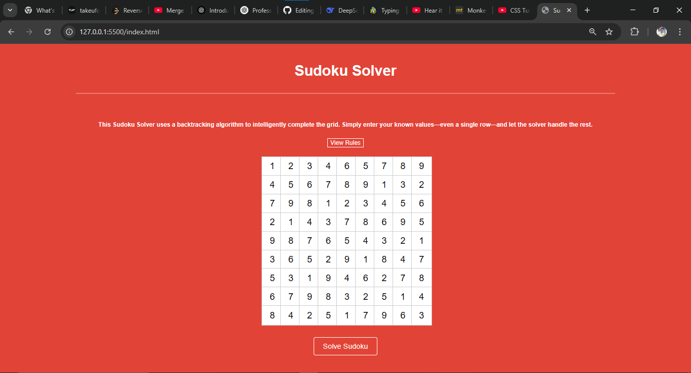

# 🧩 Sudoku Solver Web App

This is a Sudoku Solver web application built using HTML, CSS, and JavaScript. It allows users to input Sudoku puzzles and solves them instantly using a backtracking algorithm.

## 🔧 Features

- Interactive 9x9 Sudoku grid input
- Validates input format
- Solves Sudoku puzzles using backtracking algorithm
- Highlights the solution on the board
- Clear/reset functionality

## 🚀 Technologies Used

- HTML
- CSS
- JavaScript

## 📸 Project Preview

## 📂 How to Use

1. Clone this repository:
git clone https://github.com/Jilan4123/Sudoku-Solver-Project1.git
2. Open `index.html` in your browser.
3. Enter the Sudoku puzzle and click on “Solve”.

## 📈 Learning Outcomes

- Deepened understanding of backtracking algorithms
- Improved DOM manipulation and JavaScript logic
- Hands-on experience with building logic-based web tools

## 🔗 Live Demo

[Click here to view live](https://jilan4123.github.io/Sudoku-Solver-Project1)

✅ This project is live and fully functional — feel free to explore it!

## 📬 Contact

If you want to connect or ask anything about this project, feel free to message me on [LinkedIn](https://www.linkedin.com/in/jilan4123)

---

Made by Jilan
